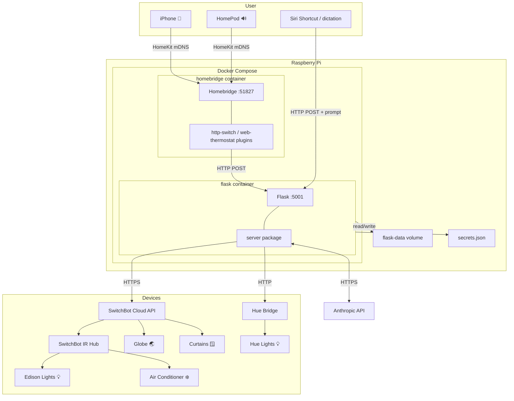

# home-cli

Flask server for smart home control, exposed to HomeKit via Homebridge, with natural language control via Claude tool calling and cron-based scheduling.

Devices:
- Edison bulbs
- Philips Hue lights
- Curtains
- Air conditioner



## Requirements

- Docker

## Setup

Copy secrets to the project root:

```json
// secrets.json
{
    "token": "YOUR_SWITCHBOT_TOKEN",
    "secret": "YOUR_SWITCHBOT_SECRET",
    "hue_bridge_ip": "YOUR_BRIDGE_IP",
    "hue_username": "YOUR_HUE_USERNAME",
    "anthropic_api_key": "YOUR_ANTHROPIC_API_KEY"
}
```

Install git hooks:

```bash
./setup.sh
```

## Running

```bash
docker compose up -d --build
```

The Flask server runs on port 5001. Homebridge runs on port 51827.

## Pairing with HomeKit

Open the Home app, tap + > Add Accessory, and enter pin `031-45-154`.

## API

| Method | Endpoint | Description |
|--------|----------|-------------|
| GET | `/status` | Current state of all devices |
| GET | `/switchbot/devices` | List all SwitchBot devices |
| POST | `/switchbot/globe/<on\|off>` | Globe light |
| POST | `/switchbot/edison/<on\|off>` | Edison lights |
| POST | `/switchbot/curtain/<open\|close>` | Curtains |
| GET | `/switchbot/ac/status` | AC state |
| GET | `/switchbot/ac/targetTemperature?value=FLOAT` | Set AC temperature |
| GET | `/switchbot/ac/targetHeatingCoolingState?value=INT` | Set AC mode (0=off, 1=heat, 2=cool, 3=auto) |
| POST | `/hue/on` | Hue lights on |
| POST | `/hue/off` | Hue lights off |
| POST | `/preset/<name>` | Apply a preset from `config/presets.json` |
| POST | `/presence/enter` | Triggered by GPS arrival or motion detected — restores state from last snapshot |
| POST | `/presence/leave` | Triggered by GPS departure — saves snapshot and turns off all lights |
| POST | `/llm` | Natural language command via `{"prompt": "..."}` — routed through Claude |
